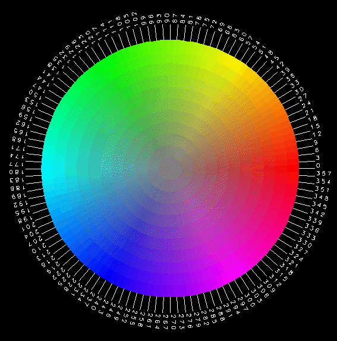

[](https://urbanjost.github.io/M_io/index.html)

## Name

M_color - Fortran module for converting between color models

## Description
The M_color Fortran module is described in the 
[M_color overview](md/M_color.3.md "top document for M_color.f90").
which also comes in the distribution as man-pages and as individual 
[HTML](https://urbanjost.github.io/M_color/man3.html "HTML index for M_color.f90")
documents as well as in a 
[single HTML document](https://urbanjost.github.io/M_color/BOOK_M_color.html)
(requires javascript). 

A [CHANGELOG](docs/CHANGELOG.md) provides a history of significant changes and issues. 

## Download
    git clone https://github.com/urbanjost/M_color.git
    cd M_color/src
    # change Makefile if not using one of the listed compilers
     
    # for gfortran
    make clean
    make F90=gfortran gfortran
     
    # for ifort
    make clean
    make F90=ifort ifort

    # for nvfortran
    make clean
    make F90=nvfortran nvfortran

This will compile the M_color module and build all the example programs
from the document pages in the examples/ sub-directory.

---

---

## Supports FPM
#### (registered at the [fpm(1) registry](https://github.com/fortran-lang/fpm-registry) )

Alternatively, download the github repository and build it with 
fpm ( as described at [Fortran Package Manager](https://github.com/fortran-lang/fpm) )

```bash
     git clone https://github.com/urbanjost/M_color.git
     cd M_color
     fpm test
```
or just list it as a dependency in your fpm.toml project file.

```toml
     [dependencies]
     M_color        = { git = "https://github.com/urbanjost/M_color.git" }
```
### Developer Documentation

 - The code was run through [ford(1)](https://politicalphysicist.github.io/ford-fortran-documentation.html)
   to produce a [developers' document](https://urbanjost.github.io/M_color/fpm-ford/index.html).
 - [github action status](docs/STATUS.md)

---

[](https://urbanjost.github.io/M_io/index.html)
