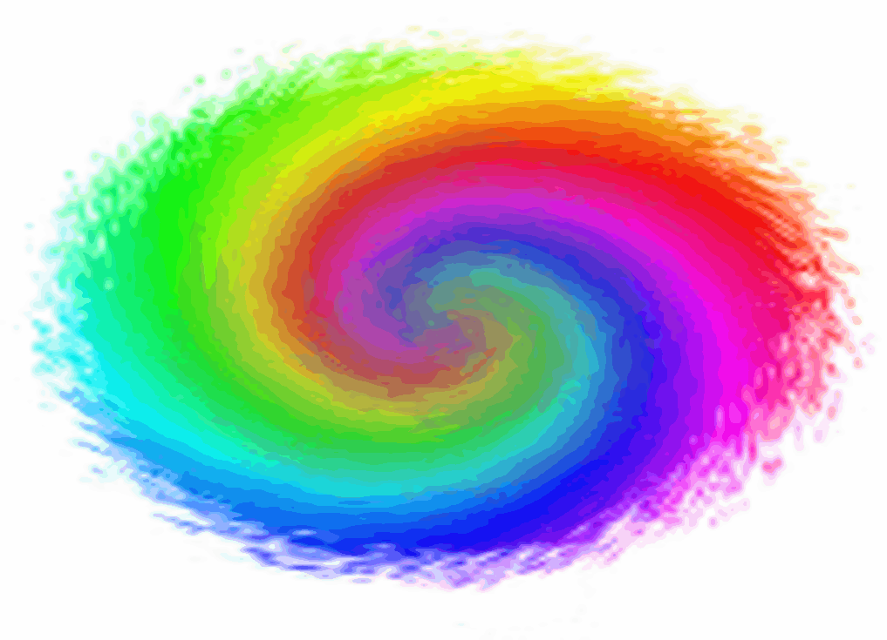

<?
<body>

  

    

      <h1> Fortran color module M_color</h1>

      <dl>

        <dt><a name="M_COLOR" id="M_COLOR">NAME</a></dt>

        <dd><em>M_COLOR(3f)</em> - [M_color] a Fortran module that lets you convert between common color models </dd>

        <dt>SYNOPSIS</dt>

        <dd>
          <pre>
   use M_color, only : <a href="hue.3.md">hue</a>, <a href="closest_color_name.3.md">closest_color_name</a>, <a href="color_name2rgb.3.md">color_name2rgb</a>, <a href="rgbmono.3.md">rgbmono</a>
</pre>
        </dd><!-- ======================================================================= -->

        <dt>DESCRIPTION</dt>

        <dd>
          
Highly accurate color conversions are a tricky business, and color is a complex topic; but these simplified conversions between common color
          models work quite well for most basic needs.

          
For most uses the only user routine called is <a href="hue.3.md">HUE(3f)</a>.  It is a single routine that interfaces to all the private
          low-level color conversion routines to convert a color's components from one color model to another. HUE(3f) converts between the following color
          models:

          <ul>
            <li>RGB - Red, Green, Blue (color TV monitors)</li>
            <li>HLS - Hue, Lightness, Saturation</li>
            <li>CMY - Cyan, Magenta, Yellow (pigment-based printing devices)</li>
            <li>HSV - Hue, Saturation, Value</li>
            <li>YIQ - Broadcast TV color system</li>
          </ul>

          
In addition to the reversible color model conversions there are a few other user-callable color-related procedures:

         <ul> 
          <li><a href="closest_color_name.3.md">CLOSEST_COLOR_NAME</a>:  given RGB values, try to find closest named color </li>
          <li><a href="color_name2rgb.3.md">COLOR_NAME2RGB</a>:  given a color name, return RGB color values in range 0 to 100 </li>
          <li><a href="rgbmono.3.md">RGBMONO</a>:  convert RGB colors to a reasonable grayscale </li>
         </ul>

          <h3>2*N Design of the module</h3>

          <h2>INTERNAL DESIGN</h2>

          

	     For reference, the rest of the library is composed of PRIVATE
             procedures. For each color model supported the general idea
             of the module is that there are two
             routines for each color model:
	  

          <ul>
            <li>One converts that model to the RGB model</li>
            <li>The other converts from RGB to that model</li>
          </ul>

          

	     This allows conversions between all color models with only
             2*N routines required to go from any model to any other. That
             is, to go from model A to model B the intent is that the module
             would make two calls:
	  

          <pre>
    call modelA2rgb(...)
    call rgb2modelB(...)
</pre>

          
The resulting internal routines that result are:

          <ul>
            <li>
              <a href="#HLSRGB">HLSRGB</a> given hue, lightness, saturation calculate red, green, and blue components

              <ul>
                <li><a href="#RGBVAL">RGBVAL</a> ensure a value is in the appropriate range and quadrant</li>
              </ul>
            </li>

            <li><a href="#HVSRGB">HVSRGB</a> given hue, saturation, value calculate red, green, and blue components</li>

            <li><a href="#CMYRGB">CMYRGB</a> given cyan, magenta, and yellow components calculate red, green, and blue components</li>

            <li><a href="#YIQRGB">YIQRGB</a> given luma(gray scale), orange-blue chrominance, and purple-green chrominance components calculate red, green,
            and blue components</li>

            <li><a href="#RGBHVS">RGBHVS</a> given red, green, blue values calculate hue, value, and saturation components</li>

            <li><a href="#RGBHLS">RGBHLS</a> given red, green, blue values calculate hue, lightness, and saturation components</li>

            <li><a href="#RGBCMY">RGBCMY</a> given red, green, blue values calculate cyan, magenta, yellow components</li>

            <li><a href="#RGBYIQ">RGBYIQ</a> given red, green, blue values calculate luma(gray scale), orange-blue chrominance, and purple-green chrominance
            components</li>
          </ul>
        </dd><!-- ======================================================================= -->

        <dt>REFERENCES</dt>

        <dd>The algorithms are based on chapter 17 of "Fundamentals of Interactive Computer Graphics"; J. D. Foley and A. Van Dam.</dd>

      <dl>

        <dt><a name="RGBHLS" id="RGBHLS">NAME</a></dt>

        <dd>RGBHLS(3fp) - [M_color] Given red, green, and blue color components calculates the hue, lightness, and saturation for a color </dd>

        <dt>SYNOPSIS</dt>

        <dd>
          <pre>
   subroutine rgbhls(r,g,b,h,l,s,status)

    real, intent(in)  :: r ! the red component as a value of 0 to 100
    real, intent(in)  :: g ! the green component as a value of 0 to 100
    real, intent(in)  :: b ! the blue component as a value of 0 to 100
    real, intent(out) :: h ! the hue value in the range of 0 to 360 degrees
    real, intent(out) :: l ! the lightness as a percent value from 0 to 100
    real, intent(out) :: s ! the saturation as a percent from 0 to 100
    integer           :: status
   
</pre>
        </dd>

        <dt>DESCRIPTION</dt>

        <dd>
          RGB values are in the range 0-100; hue is 0-360 degrees; lightness and saturation have a range of 0-100. 
           

          <blockquote>
            <table border="1">
              <tr>
                <th>Color</th>
                <th colspan="3">RGB</th>
                <th colspan="3">HLS</th>
                <th>Sample</th>
              </tr>

              <tr align="right">
                <td align="left">Red</td>
                <td width="30">100.0</td>
                <td width="30">0.0</td>
                <td width="30">0.0</td>
                <td width="30">0</td>
                <td width="30">50.0</td>
                <td width="30">100.0</td>
                <td class="c14"></td>
              </tr>

              <tr align="right">
                <td align="left">Yellow</td>
                <td>100.0</td>
                <td>100.0</td>
                <td>0.0</td>
                <td>60</td>
                <td>50.0</td>
                <td>100.0</td>
                <td class="c15"></td>
              </tr>

              <tr align="right">
                <td align="left">Green</td>
                <td>0.0</td>
                <td>100.0</td>
                <td>0.0</td>
                <td>120</td>
                <td>50.0</td>
                <td>100.0</td>
                <td class="c16"></td>
              </tr>

              <tr align="right">
                <td align="left">Cyan</td>
                <td>0.0</td>
                <td>100.0</td>
                <td>100.0</td>
                <td>180</td>
                <td>50.0</td>
                <td>100.0</td>
                <td class="c17"></td>
              </tr>

              <tr align="right">
                <td align="left">Blue</td>
                <td>0.0</td>
                <td>0.0</td>
                <td>100.0</td>
                <td>240</td>
                <td>50.0</td>
                <td>100.0</td>
                <td class="c18"></td>
              </tr>

              <tr align="right">
                <td align="left">Magenta</td>
                <td>100.0</td>
                <td>0.0</td>
                <td>100.0</td>
                <td>300</td>
                <td>50.0</td>
                <td>100.0</td>
                <td class="c19"></td>
              </tr>

              <tr align="right">
                <td align="left">White</td>
                <td>100.0</td>
                <td>100.0</td>
                <td>100.0</td>
                <td>(any)</td>
                <td>100.0</td>
                <td>(any)</td>
                <td class="c20"></td>
              </tr>

              <tr align="right">
                <td align="left">Black</td>
                <td>0.0</td>
                <td>0.0</td>
                <td>0.0</td>
                <td>(any)</td>
                <td>0.0</td>
                <td>(any)</td>
                <td class="c21"></td>
              </tr>

              <tr align="right">
                <td align="left">Maroon</td>
                <td>50.0</td>
                <td>0.0</td>
                <td>0.0</td>
                <td>0</td>
                <td>25.0</td>
                <td>100.0</td>
                <td class="c22"></td>
              </tr>

              <tr align="right">
                <td align="left">Pink</td>
                <td>100.0</td>
                <td>50.0</td>
                <td>50.0</td>
                <td>0</td>
                <td>75.0</td>
                <td>100.0</td>
                <td class="c23"></td>
              </tr>
            </table>
          </blockquote>
        </dd>

      </dl>

      <dl>

        <dt><a name="RGBHVS" id="RGBHVS">NAME</a></dt>

        <dd>RGBHVS(3fp) - [M_color] calculates the hue, value, &amp; saturation for a color given in red, green, &amp; blue components values.
        </dd>

        <dt>SYNOPSIS</dt>

        <dd>
          <pre>
   subroutine rgbhvs(r,g,b,h,v,s,status)

    real, intent(in)  :: r ! the red component as a value of 0 to 100.
    real, intent(in)  :: g ! the green component as a value of 0 to 100.
    real, intent(in)  :: b ! the blue component as a value of 0 to 100.
    real, intent(out) :: h ! the hue value in the range of 0 to 360 degrees
    real, intent(out) :: v ! the "value" as a percent value from 0 to 100.
    real, intent(out) :: s ! the saturation as a percent from 0 to 100.
    integer           :: status
   
</pre>
          <pre>

</pre>
        </dd>

        <dt>DESCRIPTION</dt>

        <dd>
          RGBHVS() calculates the hue, value, &amp; saturation for a color given in red, green, &amp; blue components values. 
           

          <blockquote>
            <table border="1" class="dtable">
              <tr>
                <th>Color</th>

                <th>Color 
                name</th>

                <th>Hex</th>

                <th>(R,G,B)</th>

                <th>(H,S,V)</th>
              </tr>

              <tr>
                <td class="c21"></td>
                <td>Black</td>
                <td>#000000</td>
                <td>(0,0,0)</td>
                <td>(0&ordm;,0%,0%)</td>
              </tr>

              <tr>
                <td class="c20"></td>
                <td>White</td>
                <td>#FFFFFF</td>
                <td>(100,100,100)</td>
                <td>(0&ordm;,0%,100%)</td>
              </tr>

              <tr>
                <td class="c14"></td>

                <td>Red</td>

                <td>#FF0000</td>

                <td>(100,0,0)</td>

                <td>(0&ordm;,100%,100%)</td>
              </tr>

              <tr>
                <td class="c16"></td>

                <td>Lime</td>

                <td>#00FF00</td>

                <td>(0,100,0)</td>

                <td>(120&ordm;,100%,100%)</td>
              </tr>

              <tr>
                <td class="c18"></td>

                <td>Blue</td>

                <td>#0000FF</td>

                <td>(0,0,100)</td>

                <td>(240&ordm;,100%,100%)</td>
              </tr>

              <tr>
                <td class="c15"></td>

                <td>Yellow</td>

                <td>#FFFF00</td>

                <td>(100,100,0)</td>

                <td>(60&ordm;,100%,100%)</td>
              </tr>

              <tr>
                <td class="c17"></td>

                <td>Cyan</td>

                <td>#00FFFF</td>

                <td>(0,100,100)</td>

                <td>(180&ordm;,100%,100%)</td>
              </tr>

              <tr>
                <td class="c19"></td>

                <td>Magenta</td>

                <td>#FF00FF</td>

                <td>(100,0,100)</td>

                <td>(300&ordm;,100%,100%)</td>
              </tr>

              <tr>
                <td class="c24"></td>

                <td>Silver</td>

                <td>#C0C0C0</td>

                <td>(75,75,75)</td>

                <td>(0&ordm;,0%,75%)</td>
              </tr>

              <tr>
                <td class="c25"></td>

                <td>Gray</td>

                <td>#808080</td>

                <td>(50,50,50)</td>

                <td>(0&ordm;,0%,50%)</td>
              </tr>

              <tr>
                <td class="c22"></td>

                <td>Maroon</td>

                <td>#800000</td>

                <td>(50,0,0)</td>

                <td>(0&ordm;,100%,50%)</td>
              </tr>

              <tr>
                <td class="c26"></td>

                <td>Olive</td>

                <td>#808000</td>

                <td>(50,50,0)</td>

                <td>(60&ordm;,100%,50%)</td>
              </tr>

              <tr>
                <td class="c27"></td>

                <td>Green</td>

                <td>#008000</td>

                <td>(0,50,0)</td>

                <td>(120&ordm;,100%,50%)</td>
              </tr>

              <tr>
                <td class="c28"></td>

                <td>Purple</td>

                <td>#800080</td>

                <td>(50,0,50)</td>

                <td>(300&ordm;,100%,50%)</td>
              </tr>

              <tr>
                <td class="c29"></td>

                <td>Teal</td>

                <td>#008080</td>

                <td>(0,50,50)</td>

                <td>(180&ordm;,100%,50%)</td>
              </tr>

              <tr>
                <td class="c30"></td>

                <td>Navy</td>

                <td>#000080</td>

                <td>(0,0,50)</td>

                <td>(240&ordm;,100%,50%)</td>
              </tr>
            </table>
          </blockquote>
        </dd><!-- ======================================================================= -->

      </dl>

      <dl>
        <!-- ======================================================================= -->

        <dt><a name="CMYRGB" id="CMYRGB">NAME</a></dt>

        <dd>cmyrgb(3fp) - [M_color] calculates the cyan, magenta, and yellow components given the red, green, and blue component values. </dd>
        <!-- ======================================================================= -->

        <dt>SYNOPSIS</dt>

        <dd>
          <pre>
   subroutine cmyrgb(c,m,y,r,g,b,status)

    real, intent(in)  :: c ! the cyan component as a value in the range of 0 to 100
    real, intent(in)  :: m ! the magenta component as a value in the range of 0 to 100
    real, intent(in)  :: y ! the yellow component as a value in the range of 0 to 100
    real, intent(out) :: r ! the red component as a value in the range of 0 to 100
    real, intent(out) :: g ! the green component as a value in the range of 0 to 100
    real, intent(out) :: b ! the blue component as a value in the range of 0 to 100
    integer           :: status
   
</pre>
        </dd><!-- ======================================================================= -->

        <dt>DESCRIPTION</dt>

        <dd>cmyrgb() calculates the cyan, magenta, and yellow components given the red, green, and blue component values. 
        <!-- ======================================================================= --></dd>
      </dl>

      <dl>
        <!-- ======================================================================= -->

        <dt><a name="RGBCMY" id="RGBCMY">NAME</a></dt>

        <dd>rgbcmy(3fp) - [M_color] calculates the cyan, magenta, and yellow components given the red, green, and blue component values. </dd>
        <!-- ======================================================================= -->

        <dt>SYNOPSIS</dt>

        <dd>
          <pre>
   subroutine rgbcmy(r,g,b,c,m,y,status)

    real, intent(in)  :: r ! the red component as a value in the range of 0 to 100
    real, intent(in)  :: g ! the green component as a value in the range of 0 to 100
    real, intent(in)  :: b ! the blue component as a value in the range of 0 to 100
    real, intent(out) :: c ! the cyan component as a value in the range of 0 to 100
    real, intent(out) :: m ! the magenta component as a value in the range of 0 to 100
    real, intent(out) :: y ! the yellow component as a value in the range of 0 to 100
    integer           :: status
   
</pre>
        </dd><!-- ======================================================================= -->

        <dt>DESCRIPTION</dt>

        <dd>
          Table ... 
           

          <blockquote>
            <table border="1">
              <tr>
                <th>Color</th>

                <th>
                  Color

                  
name

                </th>

                <th>(C,M,Y)</th>

                <th>( R, G, B)</th>

                <th>Hex</th>
              </tr>

              <tr>
                <td class="c21"></td>

                <td>Black</td>

                <td>(100,100,100)</td>

                <td>( 0, 0, 0)</td>

                <td>#000000</td>
              </tr>

              <tr>
                <td class="c20"></td>

                <td>White</td>

                <td>( 0, 0, 0)</td>

                <td>(100,100,100)</td>

                <td>#FFFFFF</td>
              </tr>

              <tr>
                <td class="c14"></td>

                <td>Red</td>

                <td>( 0,100,100)</td>

                <td>(100, 0, 0)</td>

                <td>#FF0000</td>
              </tr>

              <tr>
                <td class="c16"></td>

                <td>Green</td>

                <td>(100, 0,100)</td>

                <td>( 0,100, 0)</td>

                <td>#00FF00</td>
              </tr>

              <tr>
                <td class="c18"></td>

                <td>Blue</td>

                <td>(100,100, 0)</td>

                <td>( 0, 0,100)</td>

                <td>#0000FF</td>
              </tr>

              <tr>
                <td class="c15"></td>

                <td>Yellow</td>

                <td>( 0, 0,100)</td>

                <td>(100,100, 0)</td>

                <td>#FFFF00</td>
              </tr>

              <tr>
                <td class="c17"></td>

                <td>Cyan</td>

                <td>(100, 0, 0)</td>

                <td>( 0,100,100)</td>

                <td>#00FFFF</td>
              </tr>

              <tr>
                <td class="c19"></td>

                <td>Magenta</td>

                <td>( 0,100, 0)</td>

                <td>(100, 0,100)</td>

                <td>#FF00FF</td>
              </tr>
            </table>
          </blockquote><!-- ======================================================================= -->
        </dd><!-- ======================================================================= -->

      </dl>

      <dl>
        <!-- ======================================================================= -->

        <dt><a name="RGBVAL" id="RGBVAL">NAME</a></dt>

        <dd>RGBVAL(3fp) - [M_color] is an internal private function used by hlsrgb(3fp). </dd>
        <!-- ======================================================================= -->

        <dt>SYNOPSIS</dt>

        <dd>
          <pre>
   subroutine rgbval(clr1,clr2,h)

    integer, intent(in) :: h ! H is the hue value in degrees
    real, intent(in) :: clr1 !
    real, intent(in) :: clr2 !
   
</pre>
        </dd><!-- ======================================================================= -->

        <dt>DESCRIPTION</dt>

        <dd>Function RGBVAL(3f) is an internal private function used by hlsrgb().</dd>

      </dl>

      <dl>

        <dt><a name="HLSRGB" id="HLSRGB">NAME</a></dt>

        <dd>HLSRGB(3fp) - [M_color] calculates the red, green, &amp; blue components for a color given in hue, lightness, &amp; saturation values.
        </dd>

        <dt>SYNOPSIS</dt>

        <dd>
          <pre>
   subroutine hlsrgb (h,l,s,r,g,b,status)

    real, intent(in)  :: h ! hue value in the range of 0 to 360 degrees
    real, intent(in)  :: l ! lightness as a percent value from 0 to 100.
    real, intent(in)  :: s ! saturation as a percent from 0 to 100.
    real, intent(out) :: r ! red component as a value of 0 to 100.
    real, intent(out) :: g ! green component as a value of 0 to 100.
    real, intent(out) :: b ! blue component as a value of 0 to 100.
    integer           :: status
   
</pre>
        </dd><!-- ======================================================================= -->

        <dt>DESCRIPTION</dt>

        <dd>HLSRGB() calculates the red, green, &amp; blue components for a color given in hue, lightness, &amp; saturation values.</dd>

      </dl>

      <dl>
        <!-- ======================================================================= -->

        <dt><a name="HVSRGB" id="HVSRGB">NAME</a></dt>

        <dd>HVSRGB(3fp) - [M_color] calculates the red, green, &amp; blue components for a color given in hue, value, &amp; saturation values.
        </dd>

        <dt>SYNOPSIS</dt>

        <dd>
          <pre>
   subroutine hvsrgb(h,v,s,r,g,b,status)

    real, intent(in)  :: h ! H is the hue value in the range of 0 to 360 degrees
    real, intent(in)  :: v ! V is the "value" as a percent value from 0 to 100.
    real, intent(in)  :: s ! S is the saturation as a percent from 0 to 100.
    real, intent(out) :: r ! R is the red component as a value of 0 to 100.
    real, intent(out) :: g ! G is the green component as a value of 0 to 100.
    real, intent(out) :: b ! B is the blue component as a value of 0 to 100.
    integer           :: status
   
</pre>
        </dd>

        <dt>DESCRIPTION</dt>

        <dd>HVSRGB() calculates the red, green, &amp; blue components for a color given in hue, value, &amp; saturation values.</dd>

      </dl>

      <dl>

        <dt><a name="YIQRGB" id="YIQRGB">NAME</a></dt>

        <dd>YIQRGB(3fp) - [M_color] Convert luma, orange-blue chrominance, and purple-green chrominance to RGB values. </dd>

        <dt>SYNOPSIS</dt>

        <dd>
          <pre>
   subroutine yiqrgb(y,i,q,r,g,b,status)

    real,intent(in)  :: y,i,q
    real,intent(out) :: r,g,b
    integer          :: status
   
</pre>
        </dd><!-- ======================================================================= -->

        <dt>DESCRIPTION</dt>

        <dd>Convert luma, orange-blue chrominance, and purple-green chrominance to RGB values.</dd>
        <!-- ======================================================================= -->

      </dl>

      <dl>
        <!-- ======================================================================= -->

        <dt><a name="RGBYIQ" id="RGBYIQ">NAME</a></dt>

        <dd>RGBYIQ(3fp) - [M_color] Convert RGB values to luma, orange-blue chrominance, and purple-green chrominance.</dd>
        <!-- ======================================================================= -->

        <dt>SYNOPSIS</dt>

        <dd>
          <pre>
   subroutine rgbyiq(r,g,b,y,i,q,status)

    real,intent(in)  :: r,g,b
    real,intent(out) :: y,i,q
    integer          :: status
   
</pre>
        </dd><!-- ======================================================================= -->

        <dt>DESCRIPTION</dt>

        <dd>Convert RGB values to luma, orange-blue chrominance, and purple-green chrominance.</dd>
        <!-- ======================================================================= -->

      </dl>
    

  

</body>
</html>
