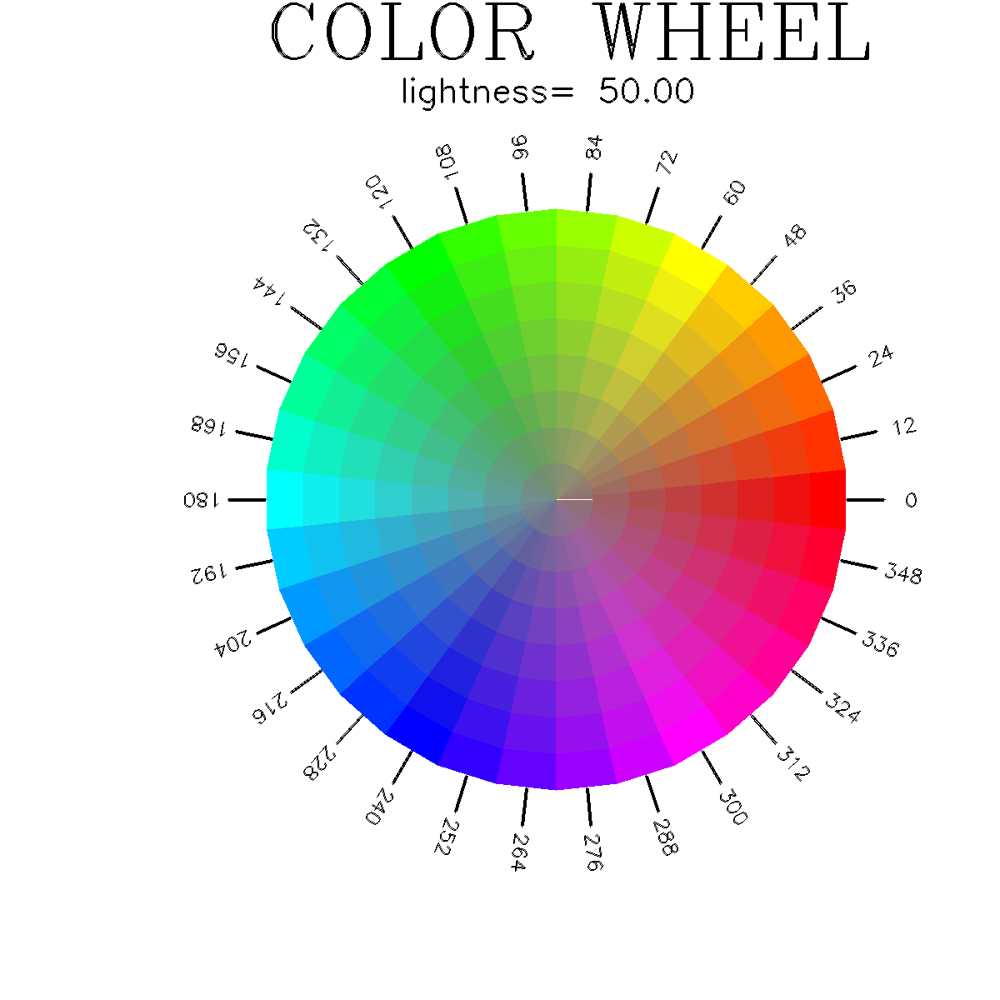

<?
<body>
  

  

    

      

      

      <h3><a name="0">NAME</a></h3>

      <blockquote>
        <b>huegif(1f)</b> - [M_pixel] generate color wheels as GIF pixmap files 
      </blockquote>

      <h3><a name="6">SYNOPSIS</a></h3>

      <blockquote>
        <pre>
<b>huegif</b> [ <b>--help</b>| <b>--version</b>]
</pre>
      </blockquote>

      <h3><a name="2">DESCRIPTION</a></h3>

      <blockquote>
        
Generates color wheels using the HSL (Hue Lightness, Saturation) model as GIF pixel files.

        
The following files will be generated, of the name hue.3_NNN.gif, where NNN is the lightness for the particular plot:

        <pre>
      hue.3_100.gif
      hue.3_095.gif
      hue.3_090.gif
      hue.3_085.gif
      hue.3_080.gif
      hue.3_075.gif
      hue.3_070.gif
      hue.3_065.gif
      hue.3_060.gif
      hue.3_055.gif
      hue.3_050.gif
      hue.3_045.gif
      hue.3_040.gif
      hue.3_035.gif
      hue.3_030.gif
      hue.3_025.gif
      hue.3_020.gif
      hue.3_015.gif
      hue.3_010.gif
 
</pre>
      </blockquote>

      <h3><a name="3">OPTIONS</a></h3>

      <blockquote>
        <table cellpadding="3">
          <tr valign="top">
            <td class="c10" width="6%" nowrap="nowrap">--help</td>

            <td valign="bottom">display this help and exit</td>
          </tr>

          <tr valign="top">
            <td class="c10" colspan="2">--version</td>
          </tr>

          <tr valign="top">
            <td width="6%"></td>

            <td>output version information and exit</td>
          </tr>

          <tr>
            <td></td>
          </tr>
        </table>
      </blockquote>

      

    

  

</body>
</html>
